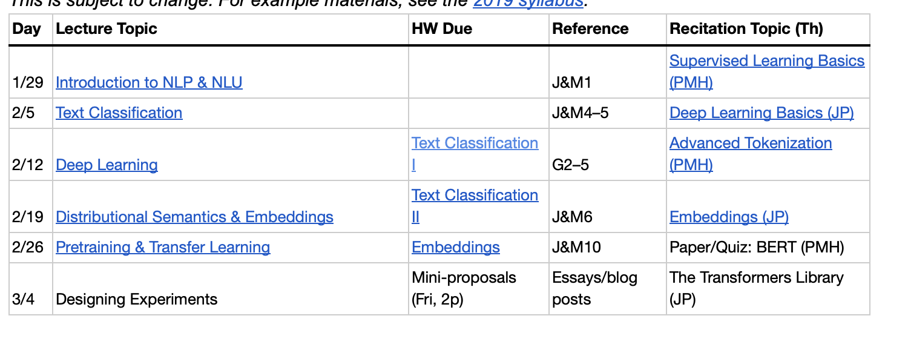
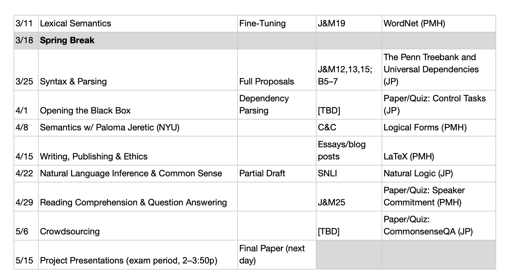

# Natural_Language_Understanding
This is a high level machine learning and deep learning courses which we specially focused on how to understand human language by using different models

## Preview:
The course is centered on text rather than speech, but within that, it will touch on the full range of applicable techniques for language understanding, including formal logics, statistical methods, distributional methods, and deep learning, and will bring in ideas from formal linguistics where they can be readily used in practice. We’ll discuss tasks like sentiment analysis, word similarity, and question answering, as well as higher level issues like how to effectively represent language meaning.

## Course Structure 

## Reference book readings:
Abbreviations above correspond to:

J&M: Dan Jurafsky and Jim Martin’s Speech and Language Processing (3rd ed., available free online, not yet out in print)

G: Yoav Goldberg’s Neural Network Methods for Natural Language Processing (1st ed., available free online through the NYU network) 

B: Emily Bender’s Linguistic Fundamentals for Natural Language Processing: 100 Essentials from Morphology and Syntax (1st ed., available free online through the NYU network)

For further reading, take a look at the follow-up book: 100 Essentials from Semantics and Pragmatics

C&C: Liz Coppock and Lucas Champollion’s Invitation to Formal Semantics Boot Camp (draft, available free online)

We’re using these books because we think they’re current and informative, and I encourage you to read them in full.
